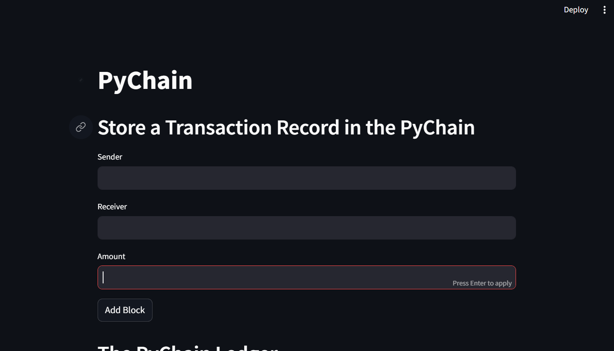
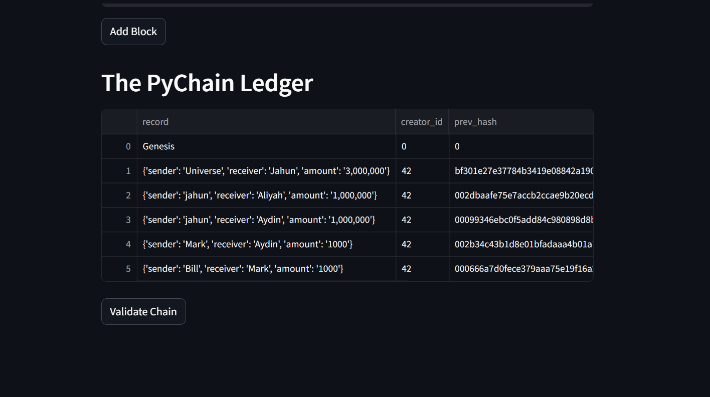
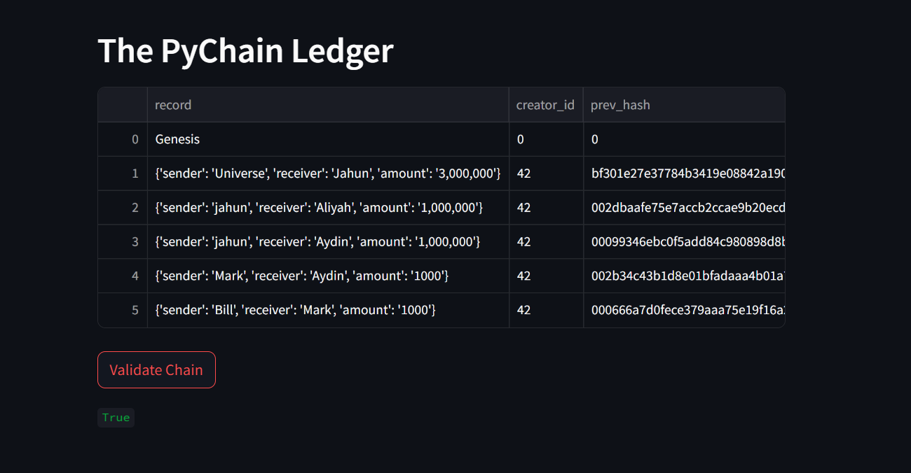
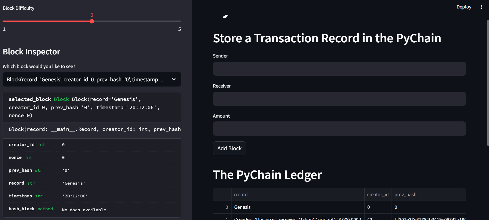
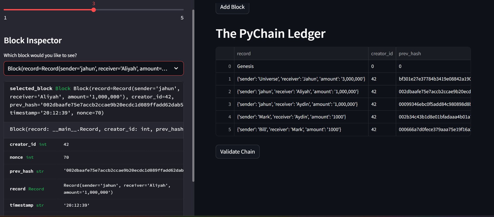
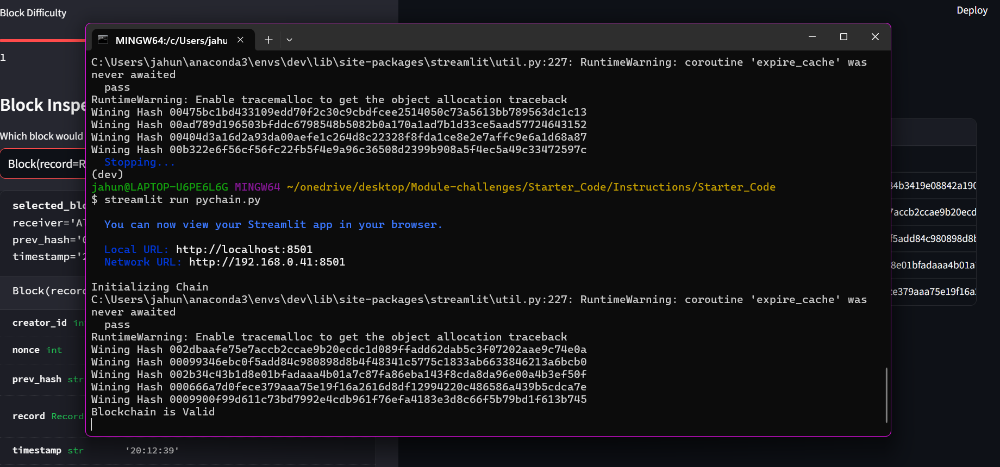

#        ***PyChain_Ledger_with_streamlit***

*Module 18 Challenge - building a blockchain with Pychain and web app using Streamlit*

----
# Table of Contents
1. [Mission Objective:](#Mission-Objective:)
2. [Create a Record Data Class](#Step-1:-Create-a-Record-Data-Class)
3. [Modify the Existing Block Data Class to Store Record Data](#Step-2:-Modify-the-Existing-Block-Data-Class-to-Store-Record-Data)
4. [Add Relevant User Inputs to the Streamlit Interface](#Step-3:-Add-Relevant-User-Inputs-to-the-Streamlit-Interface)
5. [Test the PyChain Ledger by Storing Records](#Step-4:-Test-the-PyChain-Ledger-by-Storing-Records)
6. [Results](#Results:)
7. [Conlusion](#conclusion)

---
## Mission Objective:
As the lead developer on the decentralized finance team of one of the world's largest banks, the objective was to build a blockchain-based ledger system with a user-friendly web interface. This ledger would facilitate financial transactions between partner banks while ensuring data integrity.

## Step 1: Create a Record Data Class
A new Python data class named Record was defined with attributes for sender, receiver, and amount. This class formalized the structure for recording transaction data.

## Step 2: Modify the Existing Block Data Class to Store Record Data
The Block data class was modified to store Record data. The data attribute was renamed to record, and its data type was set to the newly created Record class. This ensured that each block in the blockchain would contain transaction data.

## Step 3: Add Relevant User Inputs to the Streamlit Interface
Additional input areas were added to the Streamlit interface to capture sender, receiver, and amount for each transaction. Upon clicking the "Add Block" button, a new Block instance was created with a Record attribute containing transaction details, along with creator ID and previous hash attributes.

## Step 4: Test the PyChain Ledger by Storing Records
The complete PyChain ledger and user interface were tested by running the Streamlit application and storing multiple blocks in the ledger. Each block's contents and hashes were verified through the Streamlit dropdown menu. Additionally, the blockchain validation process was tested via the web interface, confirming the validity of the blockchain.

###  Results:
***Screenshots that the web app is valid and working***

- This image shows the ledger blank opened in Streamlit 

- Here we can see a list of transactions(blocks) on the ledger

- The Ledger is valid as stated by the True remark in green at the bottom left corner

- On the left side of the Web app, you can see the details about the genesis block, via the Block Inspector drop down menu. There is also a slider bar at the top to change the difficulty of hash algorithm for the miners to process 

- Here we have used the Block Inspector drop menu to select the 3rd transaction(block) on the blockchain. It shows all details of the block includuing the previous block hash 

- Now is the screenshot of the terminal (Git_bash). 
    - Here we can see the link to the web app
    - The "winning" hash determined by the miner, aproving the transaction
    - Last line on the terminal is showing us that the Blockchain is indeed valid 
----

## Conclusion 

Overall, this project successfully achieved the goal of developing a blockchain-based ledger system with a user-friendly interface, allowing partner banks to conduct secure and verifiable financial transactions.

**File:** [Blockchain with PyChain and Stremalit](pychain.py) 